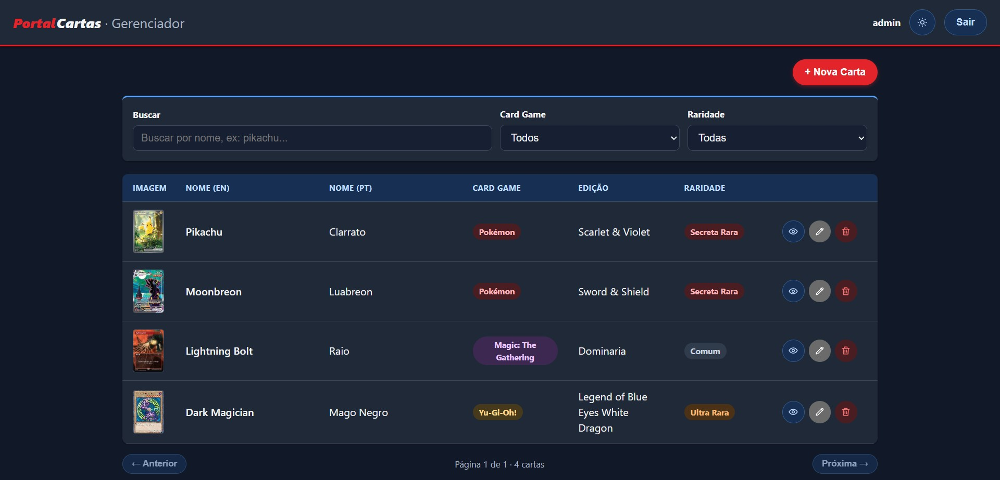
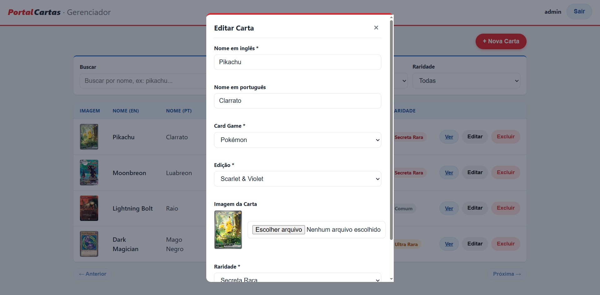
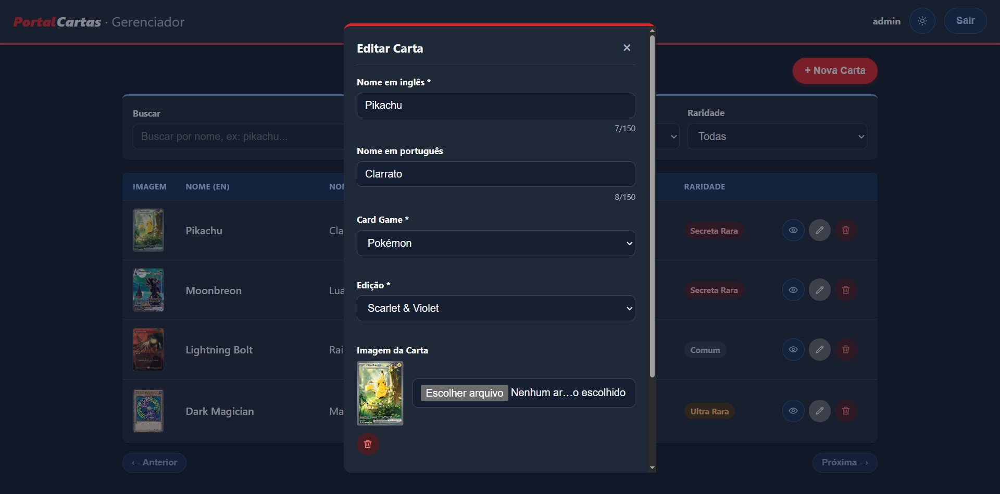
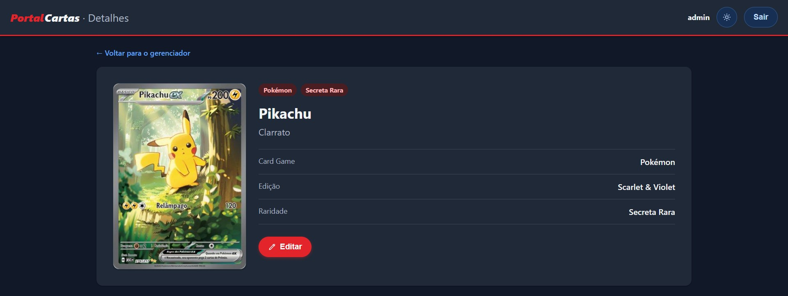
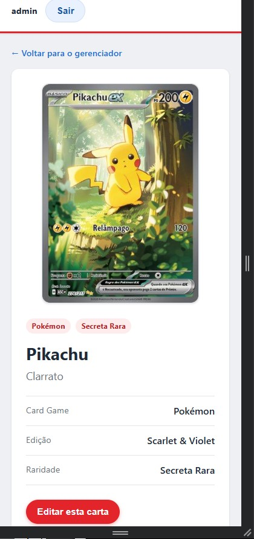

# Portal Administrativo de Cartas

Portal para gestão de cartas (Magic, Pokémon e Yu-Gi-Oh!), com autenticação por login e senha.

## Escopo: o que era pedido vs. o que foi adicionado

### ✅ Requisitos do desafio (100% atendidos)

| Requisito | Onde está |
|---|---|
| Login e senha | `POST /api/login`, tela `login.html` |
| Listar / Incluir / Editar / Excluir cartas | `admin.html` + `CardController`/`CardService`/`Card` |
| Nome EN + Nome PT (opcional) | Formulário de cadastro |
| Card Game (select fixo: Magic/Pokémon/Yu-Gi-Oh!) | Formulário de cadastro |
| Edição em cascata (desabilitado → fetch → loading → popula → reseta ao trocar) | `admin.js` (`onGameChange`) + `GET /api/editions` |
| JSON de edições do enunciado | `backend/data/editions.json`, usado como fonte de dados |
| Imagem da carta | Formulário de cadastro (ver decisão técnica sobre onde ela é guardada, na seção [Upload de imagem](#upload-de-imagem)) |
| Raridade da carta | Formulário de cadastro |
| Back-end em PHP sem framework | Confirmado: sem Composer, sem lib nenhuma no back |
| Front-end em HTML5/CSS3/JS vanilla, sem framework/lib | Confirmado: sem jQuery, Bootstrap, Tailwind, React/Vue/Angular, CDN externo ou `package.json` |
| MySQL com schema + seed | `backend/database/schema.sql` + `seed.sql` |
| README com passo a passo, credenciais e 2 decisões de UX | Este arquivo (credenciais [abaixo](#credenciais-de-teste), decisões [abaixo](#decisões-de-ux--produto)) |

### ➕ Funcionalidades extras (não fazem parte do escopo obrigatório)

Nada aqui substitui um item obrigatório — são funcionalidades extras em cima do escopo original:

- **Autenticação via JWT** (em vez de sessão simples) — ainda é "login e senha", só que sem estado no servidor
- **Filtro por texto/Card Game/Raridade** e **paginação**, ambos resolvidos no back-end
- **Página de detalhes** de cada carta (`detail.html?id=`)
- Imagem guardada como blob no MySQL (decisão técnica pra sobreviver a deploys em serviços com disco efêmero, como Railway)

## Aplicação no ar

Deploy de teste rodando no Railway (MySQL + back-end PHP + front-end estático, cada um em um serviço separado):

- **Front-end:** [marvelous-clarity-production-3243.up.railway.app/login.html](https://marvelous-clarity-production-3243.up.railway.app/login.html)
- **API:** https://backend-production-ec5a.up.railway.app/api
- **Login de teste:** ver seção [Credenciais de teste](#credenciais-de-teste) abaixo.

> Ambiente de teste temporário para avaliação — pode ser derrubado após o período do desafio.

## Stack

- **Back-end:** PHP puro (sem frameworks), PDO + MySQL
- **Front-end:** HTML5, CSS3 e JavaScript vanilla (sem bibliotecas)
- **Banco de dados:** MySQL

## Como rodar o projeto

### Opção 1 — Docker (recomendado)

Pré-requisitos: Docker e Docker Compose instalados.

```bash
docker-compose up -d
docker-compose exec app php database/seed_admin.php
```

O segundo comando cria o usuário de teste (ele gera o hash da senha em tempo de execução, por isso não vem pronto no `seed.sql`).

- Front-end: sirva a pasta `frontend/` por um servidor local em vez de abrir o arquivo direto (`file://`) — evita comportamento inconsistente de `fetch` em alguns navegadores. Duas formas de fazer isso:
  - **Com PHP instalado** (é o mesmo PHP 8+ do pré-requisito da Opção 2 abaixo — se você só for usar Docker, não precisa instalar):
    ```bash
    php -S localhost:5500 -t frontend
    ```
    e acesse `http://localhost:5500/login.html`.
  - **Sem PHP instalado**, usando a extensão **Live Server** do VS Code: abra a pasta `portal-cartas/` inteira como workspace e clique em "Go Live" a partir de `frontend/login.html`.
- API: `http://localhost:8000/api`
- MySQL: `localhost:3306` (usuário `root`, senha `root`)

### Opção 2 — Ambiente local (sem Docker)

Pré-requisitos: PHP 8+, MySQL rodando localmente.

```bash
# 1. Crie o banco e as tabelas
mysql -u root -p < backend/database/schema.sql
mysql -u root -p < backend/database/seed.sql

# 2. Configure a conexão (se seu MySQL não for root/root em localhost)
export DB_HOST=127.0.0.1
export DB_USER=root
export DB_PASS=root

# 3. Crie o usuário de teste
php backend/database/seed_admin.php

# 4. Suba o back-end
cd backend/public
php -S localhost:8000
```

Depois, abra `http://localhost:5500/login.html` no navegador (sirva a pasta `frontend/` com `php -S localhost:5500 -t frontend` em outro terminal, ou use a extensão Live Server do VS Code — evite abrir o arquivo direto via `file://`).

## Screenshots

| Gerenciador (desktop) | Gerenciador (mobile) |
|-------------------------|-------------------------|
|  |  |

| Editar carta (modal) | Detalhes (desktop) | Detalhes (mobile) |
|-------------------------|-------------------------|-------------------------|
|  |  |  |

## Credenciais de teste

| Usuário | Senha      |
|---------|------------|
| admin   | admin123   |

## Estrutura do projeto

```
portal-cartas/
├── .gitignore
├── .vscode/
│   └── settings.json       # ignora backend/ no watcher do Live Server (evita reload no meio do upload)
├── docker-compose.yml
├── docs/
│   └── screenshots/        # imagens usadas na seção Screenshots deste README
├── backend/
│   ├── Dockerfile
│   ├── public/
│   │   └── index.php       # front controller / roteador da API
│   ├── src/
│   │   ├── Config/         # conexão com o banco e constantes
│   │   ├── Models/         # acesso direto às tabelas (User, Card)
│   │   ├── Services/       # regras de negócio (AuthService, CardService)
│   │   ├── Controllers/    # recebem a request e devolvem JSON (Auth, Card)
│   │   └── Utils/          # Response, Validator e Jwt (JWT manual, sem lib)
│   ├── data/editions.json  # fonte de dados das edições por jogo
│   └── database/           # schema.sql, seed.sql, seed_admin.php e scripts de migração
└── frontend/
    ├── Dockerfile          # nginx servindo os arquivos estáticos (usado no deploy)
    ├── login.html
    ├── admin.html
    ├── detail.html          # página de detalhes de uma carta (rota própria: ?id=)
    ├── css/style.css        # mobile-first, um breakpoint em 768px
    └── js/
        ├── consts.js        # URL da API e textos/mensagens
        ├── utils.js         # helpers (toast, loading, validação de form)
        ├── api.js           # wrapper único sobre fetch
        ├── login.js
        ├── admin.js         # CRUD + select em cascata + filtro/paginação
        └── detail.js        # busca e renderiza uma carta pelo id da URL
```

A API segue arquitetura em camadas: **Controller** (recebe a request) → **Service** (valida e aplica regra de negócio) → **Model** (fala com o banco). Isso mantém cada arquivo com uma única responsabilidade e facilita testar/trocar peças isoladamente.

## Decisões de UX / Produto

1. **JWT em vez de sessão no front.** O login devolve um token assinado (HS256, implementado manualmente com `hash_hmac` — sem biblioteca externa) que o front guarda no `localStorage` e reenvia no header `Authorization: Bearer`. Isso evita todo o problema de cookie entre origens diferentes (front e back rodando em portas distintas) e mantém a API sem estado.

2. **Placeholder visual para carta sem imagem.** Em vez de deixar a célula vazia ou quebrar o layout, cartas sem imagem cadastrada mostram um bloco no mesmo formato de uma carta física com o texto "Sem imagem" — tanto na listagem quanto no formulário. Ajuda a identificar rapidamente o que ainda falta completar no cadastro.

3. **Tabela vira "cards" empilhados no mobile.** Em vez de forçar rolagem horizontal numa tabela larga em telas pequenas, cada linha se transforma em um bloco vertical com rótulo + valor. Quem for gerenciar cartas pelo celular consegue ler sem esforço.

4. **Reset automático da edição ao trocar o Card Game.** Se o usuário troca o jogo depois de já ter escolhido uma edição, a seleção anterior é limpa automaticamente — evita salvar uma combinação inconsistente (ex: jogo "Pokémon" com edição de "Magic").

5. **Imagem salva no banco, não em arquivo.** A imagem da carta é guardada como blob dentro do MySQL (colunas `image_mime`/`image_data`), não como arquivo no disco do container. Decisão técnica deliberada: o disco de serviços como o Railway é efêmero (o que foi gravado em arquivo some no próximo deploy), então guardar em arquivo faria as imagens desaparecerem sozinhas depois de um tempo. Guardando no banco, a imagem "nasce" junto com o resto do dado da carta e sobrevive a qualquer deploy, backup ou migração.

## Paginação e filtro (resolvidos no back-end)

`GET /api/cards` aceita `page`, `per_page` (padrão 12, máx. 50), `search`, `game` e `rarity` como query string, e devolve `{ items, page, per_page, total, total_pages }`. O front manda esses parâmetros a cada troca de filtro ou de página — a busca por texto compara nome em inglês, português e edição (ex: buscar "pikachu" mostra só os Pikachus); os filtros de Card Game e Raridade usam os mesmos campos do cadastro. Abaixo da tabela há os controles de "Anterior/Próxima" com o total de páginas.

## Página de detalhes

Cada carta tem uma página própria em `detail.html?id={id}` (link "Ver" na listagem, ou clicando no nome da carta), mostrando a imagem em tamanho maior e os mesmos dados do cadastro (nome EN/PT, Card Game, Edição, Raridade). O botão "Editar esta carta" abre o mesmo modal de edição do gerenciador direto nessa página, sem navegação.

## Upload de imagem

O campo de imagem do formulário aceita um arquivo real (JPG, PNG ou WEBP, até 5MB), lido no navegador (`FileReader`) e enviado como base64 dentro do próprio JSON de criação/edição da carta (`image_base64`) — não existe mais um endpoint de upload separado. O back-end decodifica, valida tipo/tamanho e grava o binário direto no banco. Ao editar uma carta sem trocar o arquivo, a imagem antiga é mantida (o campo só é sobrescrito quando um arquivo novo é selecionado). A imagem é servida por `GET /api/cards/{id}/image`, uma rota pública de propósito — uma tag `` não consegue mandar o header `Authorization`, então servir o binário sem exigir login é o jeito correto de fazer isso com JWT (o restante da API continua protegido).

## Endpoints da API

| Método | Rota                        | Descrição                                    |
|--------|------------------------------|-----------------------------------------------|
| POST   | `/api/login`                 | Autentica usuário e devolve o token JWT       |
| POST   | `/api/logout`                | No-op (logout é local: front descarta o token)|
| GET    | `/api/me`                    | Usuário autenticado atual                     |
| GET    | `/api/cards`                  | Lista cartas, paginada e filtrável (`page`, `per_page`, `search`, `game`, `rarity`) |
| GET    | `/api/cards/{id}`             | Detalhe de uma carta                          |
| GET    | `/api/cards/{id}/image`         | Binário da imagem da carta (rota pública, ver seção Upload de imagem) |
| POST   | `/api/cards`                    | Cria uma carta                                |
| PUT    | `/api/cards/{id}`               | Atualiza uma carta                            |
| DELETE | `/api/cards/{id}`               | Remove uma carta                              |
| GET    | `/api/editions?game=magic`      | Lista edições de um Card Game                 |

Todas as rotas acima, exceto `/login` e `/cards/{id}/image`, exigem o header `Authorization: Bearer <token>` (retornam `401` sem ele ou com token expirado/inválido).

## Melhorias futuras (fora do escopo desta entrega)

- Testes automatizados
- SSO
