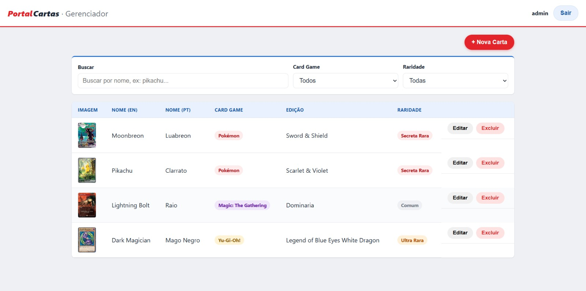
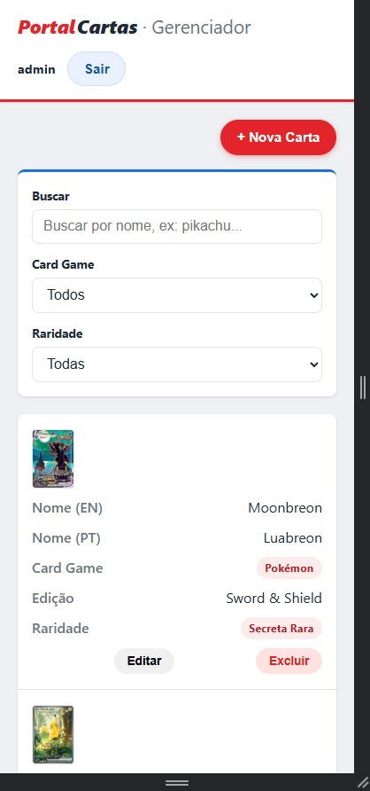

# Portal Administrativo de Cartas

Portal para gestão de cartas (Magic, Pokémon e Yu-Gi-Oh!), com autenticação por login e senha.

## Stack

- **Back-end:** PHP puro (sem frameworks), PDO + MySQL
- **Front-end:** HTML5, CSS3 e JavaScript vanilla (sem bibliotecas)
- **Banco de dados:** MySQL

## Como rodar o projeto

### Opção 1 — Docker (recomendado)

Pré-requisitos: Docker e Docker Compose instalados.

```bash
docker-compose up -d
docker-compose exec app php database/seed_admin.php
```

O segundo comando cria o usuário de teste (ele gera o hash da senha em tempo de execução, por isso não vem pronto no `seed.sql`).

- Front-end: sirva a pasta `frontend/` por um servidor local em vez de abrir o arquivo direto (`file://`) — abrir direto no navegador pode causar comportamento inconsistente de `fetch`/upload em alguns navegadores. Rode em outro terminal:
  ```bash
  php -S localhost:5500 -t frontend
  ```
  e acesse `http://localhost:5500/login.html`. (Alternativa: extensão **Live Server** do VS Code — abrindo a pasta `portal-cartas/` inteira como workspace, o `.vscode/settings.json` já incluso no repositório configura o `ignoreFiles` pra ele não recarregar a página quando o back-end grava um novo arquivo em `backend/public/uploads/` durante o upload.)
- API: `http://localhost:8000/api`
- MySQL: `localhost:3306` (usuário `root`, senha `root`)

### Opção 2 — Ambiente local (sem Docker)

Pré-requisitos: PHP 8+, MySQL rodando localmente.

```bash
# 1. Crie o banco e as tabelas
mysql -u root -p < backend/database/schema.sql
mysql -u root -p < backend/database/seed.sql

# 2. Configure a conexão (se seu MySQL não for root/root em localhost)
export DB_HOST=127.0.0.1
export DB_USER=root
export DB_PASS=root

# 3. Crie o usuário de teste
php backend/database/seed_admin.php

# 4. Suba o back-end
cd backend/public
php -S localhost:8000
```

Depois, abra `http://localhost:5500/login.html` no navegador (sirva a pasta `frontend/` com `php -S localhost:5500 -t frontend` em outro terminal, ou use a extensão Live Server do VS Code — evite abrir o arquivo direto via `file://`). Se usar Live Server, abra a pasta `portal-cartas/` inteira como workspace pra que o `.vscode/settings.json` do repositório entre em vigor (ver observação acima).

## Screenshots

| Listagem de cartas (desktop) | Listagem de cartas (mobile) |
|-------------------------------|-------------------------------|
|  |  |

## Credenciais de teste

| Usuário | Senha      |
|---------|------------|
| admin   | admin123   |

## Estrutura do projeto

```
portal-cartas/
├── docker-compose.yml
├── .vscode/
│   └── settings.json         # ignora backend/ no watcher do Live Server (evita reload no meio do upload)
├── docs/
│   └── screenshots/           # imagens usadas na seção Screenshots deste README
├── backend/
│   ├── Dockerfile
│   ├── public/
│   │   ├── index.php             # front controller / roteador da API
│   │   └── uploads/              # imagens enviadas pelo formulário (servidas estaticamente)
│   ├── src/
│   │   ├── Config/               # conexão com o banco e constantes
│   │   ├── Models/                # acesso direto às tabelas (User, Card)
│   │   ├── Services/              # regras de negócio (AuthService, CardService)
│   │   ├── Controllers/           # recebem a request e devolvem JSON (Auth, Card, Upload)
│   │   └── Utils/                 # Response, Validator e Jwt (JWT manual, sem lib)
│   ├── data/editions.json         # fonte de dados das edições por jogo
│   └── database/                  # schema.sql, seed.sql e seed_admin.php
└── frontend/
    ├── login.html
    ├── admin.html
    ├── css/style.css             # mobile-first, um breakpoint em 768px
    └── js/
        ├── consts.js             # URL da API e textos/mensagens
        ├── utils.js               # helpers (toast, loading, validação de form)
        ├── api.js                 # wrapper único sobre fetch
        ├── login.js
        └── admin.js               # CRUD + select em cascata
```

A API segue arquitetura em camadas: **Controller** (recebe a request) → **Service** (valida e aplica regra de negócio) → **Model** (fala com o banco). Isso mantém cada arquivo com uma única responsabilidade e facilita testar/trocar peças isoladamente.

## Decisões de UX / Produto

1. **JWT em vez de sessão no front.** O login devolve um token assinado (HS256, implementado manualmente com `hash_hmac` — sem biblioteca externa) que o front guarda no `localStorage` e reenvia no header `Authorization: Bearer`. Isso evita todo o problema de cookie entre origens diferentes (front e back rodando em portas distintas) e mantém a API sem estado.

2. **Placeholder visual para carta sem imagem.** Em vez de deixar a célula vazia ou quebrar o layout, cartas sem imagem cadastrada mostram um bloco no mesmo formato de uma carta física com o texto "Sem imagem" — tanto na listagem quanto no formulário. Ajuda a identificar rapidamente o que ainda falta completar no cadastro.

3. **Tabela vira "cards" empilhados no mobile.** Em vez de forçar rolagem horizontal numa tabela larga em telas pequenas, cada linha se transforma em um bloco vertical com rótulo + valor. Quem for gerenciar cartas pelo celular consegue ler sem esforço.

4. **Reset automático da edição ao trocar o Card Game.** Se o usuário troca o jogo depois de já ter escolhido uma edição, a seleção anterior é limpa automaticamente — evita salvar uma combinação inconsistente (ex: jogo "Pokémon" com edição de "Magic").

## Filtro da listagem

Acima da tabela é possível buscar por texto (compara com nome em inglês, português e edição — ex: buscar "pikachu" mostra só os Pikachus) e filtrar por Card Game e Raridade, os mesmos campos usados no cadastro. O filtro é aplicado no navegador em cima da lista já carregada.

## Upload de imagem

O campo de imagem do formulário aceita um arquivo real (JPG, PNG ou WEBP, até 5MB). Ao selecionar o arquivo, ele já é enviado para `POST /api/uploads`, que salva em `backend/public/uploads/` e devolve a URL pública — essa URL é o que fica gravado em `cards.image_url`. Ela é exibida como preview no formulário e como miniatura na listagem.

## Endpoints da API

| Método | Rota                        | Descrição                                    |
|--------|------------------------------|-----------------------------------------------|
| POST   | `/api/login`                 | Autentica usuário e devolve o token JWT       |
| POST   | `/api/logout`                | No-op (logout é local: front descarta o token)|
| GET    | `/api/me`                    | Usuário autenticado atual                     |
| GET    | `/api/cards`                  | Lista todas as cartas                         |
| GET    | `/api/cards/{id}`             | Detalhe de uma carta                          |
| POST   | `/api/cards`                    | Cria uma carta                                |
| PUT    | `/api/cards/{id}`               | Atualiza uma carta                            |
| DELETE | `/api/cards/{id}`               | Remove uma carta                              |
| GET    | `/api/editions?game=magic`      | Lista edições de um Card Game                 |
| POST   | `/api/uploads`                    | Envia uma imagem (multipart/form-data), devolve a URL |

Todas as rotas acima, exceto `/login`, exigem o header `Authorization: Bearer <token>` (retornam `401` sem ele ou com token expirado/inválido).

## Observação sobre o Live Server (VS Code)

Por padrão, a extensão Live Server vigia (watch) todos os arquivos do workspace aberto. Como o upload de imagem grava um arquivo novo dentro de `backend/public/uploads/`, isso disparava um recarregamento automático da página inteira no meio do fluxo de cadastro — dando a falsa impressão de que o modal estava "fechando sozinho". O `.vscode/settings.json` incluso no repositório resolve isso configurando `liveServer.settings.ignoreFiles` para ignorar a pasta `backend/`. Esse arquivo só tem efeito se a pasta `portal-cartas/` (raiz do repositório) for aberta como workspace no VS Code.

## Melhorias futuras (fora do escopo desta entrega)

- Testes automatizados
- SSO
- Paginação/filtro no back-end (hoje o filtro é só no front, ok para o volume de dados do desafio)
